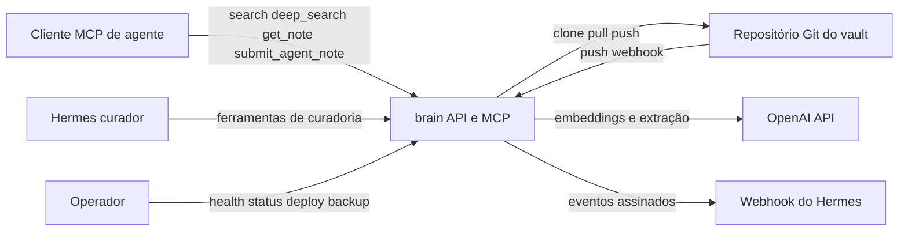
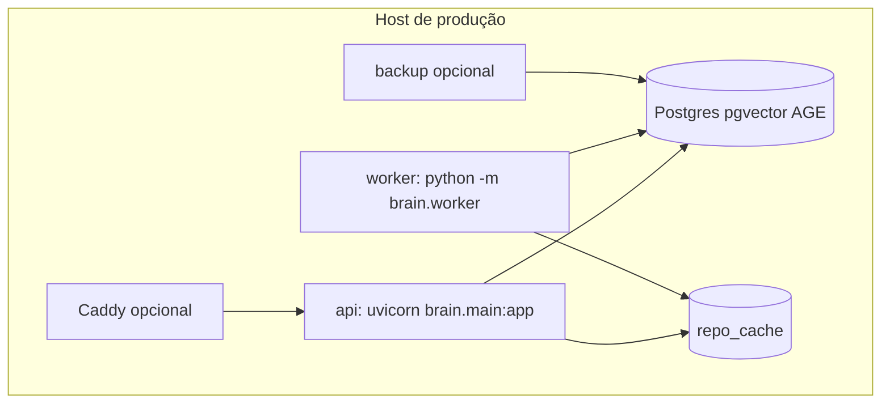
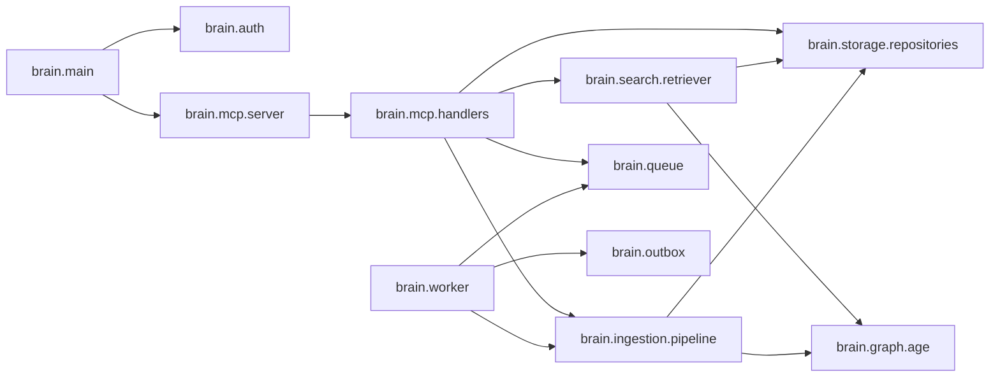
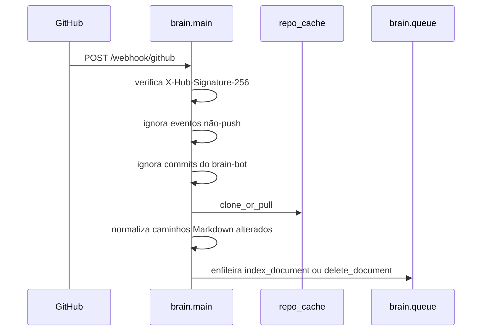
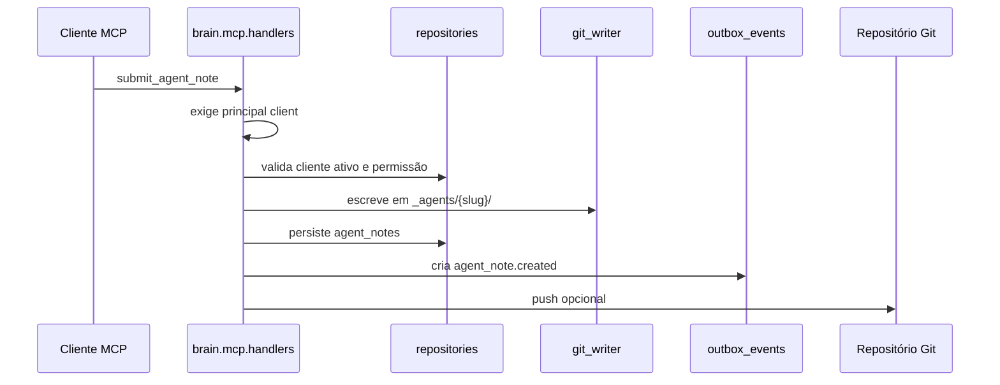
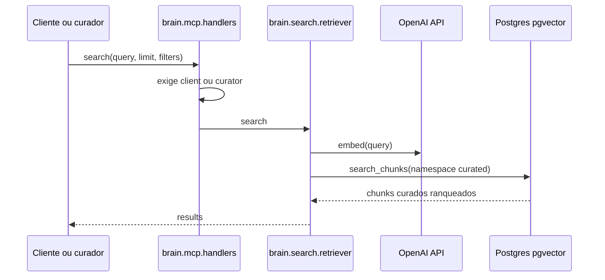
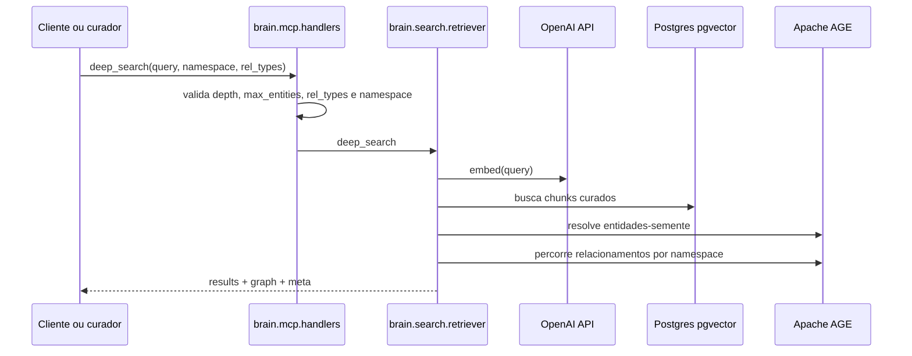
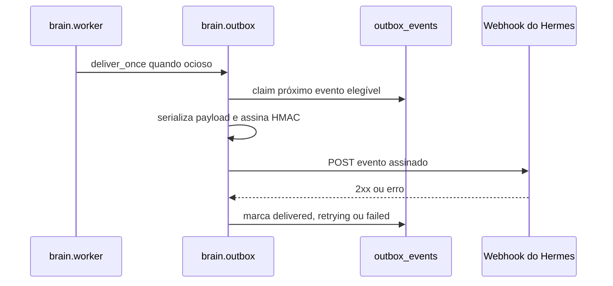

# Arquitetura

## Resumo

`brain` é um serviço FastAPI para operar um vault Markdown curado. Ele expõe endpoints HTTP operacionais: `/health` é público, `/status` exige `Authorization: Bearer <BRAIN_AUTH_TOKEN>` e `/webhook/github` exige assinatura `X-Hub-Signature-256`. O serviço também monta um servidor MCP streamable HTTP em `/mcp` para clientes de agente e para o curador Hermes.

Os atores externos são clientes MCP de agente, Hermes curador, operadores, o repositório Git do vault, a OpenAI API e o receptor de webhook do Hermes. Em runtime, a implantação Docker Compose usa os serviços `api`, `worker` e `postgres`, pode incluir `caddy` e `backup`, e compartilha o volume `repo_cache` entre API e worker.

O Postgres inclui pgvector para armazenar embeddings de chunks e Apache AGE para percorrer o grafo de entidades e relacionamentos. O `repo_cache` é um clone/cache local do vault Markdown compartilhado por API e worker: a API é responsável por pull, escrita e push Git, enquanto o worker lê arquivos desse cache para atualizar índices derivados e estado de deleção.

## Contexto Do Sistema



O diagrama omite tabelas internas do Postgres porque elas são detalhadas em [data-model.md](data-model.md); aqui o foco é a fronteira do sistema e suas dependências externas.

## Containers



- `api`: executa migrations no startup, sobe `uvicorn brain.main:app`, atende endpoints operacionais, monta o MCP em `/mcp`, faz pull do Git, escreve notas no `repo_cache` e faz push quando habilitado.
- `worker`: executa `python -m brain.worker`, lê arquivos do `repo_cache` para processar jobs de ingestão, reindexação, deleção e extração de fatos, e entrega eventos do outbox quando não há jobs pendentes.
- `postgres`: persiste documentos, chunks, embeddings, fila, outbox, notas brutas, clientes de agente e links; inclui pgvector para busca vetorial e Apache AGE para grafo.
- `repo_cache`: volume compartilhado com o clone/cache local do vault Markdown; a API controla mutações Git e o worker usa o cache como entrada de leitura para índices derivados.
- `caddy`: proxy reverso opcional do profile `proxy`, encaminhando tráfego externo para `api`.
- `backup`: serviço opcional do profile `backup`, responsável por executar rotinas de backup do Postgres.

## Componentes Internos



- `brain.main`: cria a aplicação FastAPI, registra `/health`, `/status` e `/webhook/github`, constrói dependências e monta o app MCP em `/mcp`.
- `brain.auth`: resolve tokens bearer em principals de curador ou cliente e mantém o principal atual durante a execução dos handlers MCP.
- `brain.mcp.server`: registra as ferramentas FastMCP e delega contratos públicos para os handlers.
- `brain.mcp.handlers`: aplica permissão por principal, valida entradas, orquestra escrita Git, busca, curadoria, notas brutas, clientes, links e ferramentas administrativas.
- `brain.storage.repositories`: centraliza operações SQLAlchemy sobre documentos, chunks, fila, outbox, notas, clientes, memories e links.
- `brain.ingestion.pipeline`: indexa documentos Markdown, calcula chunks e embeddings, atualiza documentos, extrai entidades e grava o grafo AGE.
- `brain.search.retriever`: implementa `search` e `deep_search` sobre chunks curados e, quando aplicável, contexto de grafo.
- `brain.graph.age`: encapsula criação, atualização, busca e percurso de entidades e relacionamentos no Apache AGE.
- `brain.queue`: define e implementa a fila de jobs persistida no Postgres.
- `brain.outbox`: assina e entrega eventos para o webhook do Hermes com controle de tentativa, retry e falha.
- `brain.worker`: consome jobs da fila, chama o pipeline de ingestão ou deleção e drena o outbox quando está ocioso.

## Fluxos Principais

### Webhook GitHub Para Indexação



O webhook aceita apenas payloads com HMAC válido. Eventos que não são `push` e pushes feitos pelo próprio `brain` são ignorados; os demais atualizam o `repo_cache`, normalizam caminhos Markdown com `normalize_repo_path` e criam jobs de indexação ou deleção.

### Criação Ou Atualização De Nota Curada

```mermaid
sequenceDiagram
    participant Hermes as Hermes curador
    participant Handler as brain.mcp.handlers
    participant GitWriter as git_writer
    participant Pipeline as pipeline.index_document
    participant Links as note_links
    participant Git as Repositório Git

    Hermes->>Handler: create_note ou update_note
    Handler->>Handler: exige principal curator
    Handler->>GitWriter: valida caminho curado
    GitWriter-->>Handler: impede escrita em _agents/
    Handler->>GitWriter: escreve Markdown no repo_cache
    Handler->>Pipeline: index_document(namespace curated)
    Handler->>Links: extrai e persiste links Obsidian
    Handler->>Git: push opcional
```

Notas curadas só podem ser criadas ou atualizadas pelo curador. O caminho passa por `git_writer.validate_curated_note_path`, que impede escrita em `_agents/`; depois o Markdown é escrito no `repo_cache`, indexado por `pipeline.index_document`, tem links extraídos e pode ser enviado ao Git remoto.

### Submissão De Nota Bruta Por Cliente



Submissões brutas exigem principal de cliente e permissão `submit_agent_note`. O conteúdo é gravado no inbox `_agents/{slug}/`, o registro operacional é persistido em `agent_notes`, um evento `agent_note.created` é criado no outbox e o commit pode ser enviado ao repositório Git.

### Busca Semântica



`search` gera embedding para a consulta e pesquisa apenas chunks de documentos curados. Filtros de origem fora de `document`, `curated` ou `note` retornam lista vazia, preservando a fronteira pública de busca.

### Deep Search



`deep_search` retorna resultados textuais curados e contexto de grafo AGE a partir de entidades-semente. Quando `namespace` é omitido, o grafo usa a estratégia global; quando informado, restringe a um namespace, seguindo as regras documentadas em [mcp-api.md](mcp-api.md).

### Entrega Do Outbox Para Hermes



Quando não há jobs de ingestão, o worker tenta entregar um evento do outbox. Cada entrega envia headers assinados para o Hermes; sucesso marca o evento como entregue, falhas temporárias agendam retry com backoff exponencial e excesso de tentativas marca o evento como falho.

## Fronteiras Arquiteturais

- Notas curadas são legíveis e pesquisáveis por ferramentas MCP públicas de leitura e busca.
- `_agents/` é inbox bruto de clientes e não é indexado para busca pública.
- `memories` são persistidas, mas não são retornadas pela busca pública MCP.
- Ferramentas administrativas de grafo são exclusivas do curador.
- `/health` é público, `/status` usa `BRAIN_AUTH_TOKEN`, `/webhook/github` exige `X-Hub-Signature-256`, e `/mcp` usa principals de curador ou cliente.

## Arquivos De Referência

- [../src/brain/main.py](../src/brain/main.py)
- [../src/brain/mcp/server.py](../src/brain/mcp/server.py)
- [../src/brain/mcp/handlers.py](../src/brain/mcp/handlers.py)
- [../src/brain/search/retriever.py](../src/brain/search/retriever.py)
- [../src/brain/ingestion/pipeline.py](../src/brain/ingestion/pipeline.py)
- [../src/brain/worker.py](../src/brain/worker.py)
- [../docker-compose.yml](../docker-compose.yml)
