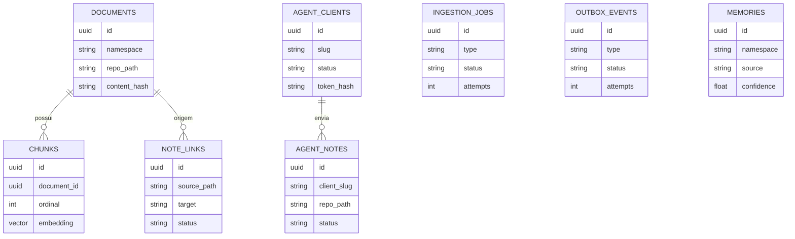

# Modelo De Dados

## Visão Geral

O Brain combina tabelas relacionais no PostgreSQL, embeddings via `pgvector` e um grafo Apache AGE para manter uma camada pesquisável sobre o vault Markdown. O modelo separa três tipos de dado:

- Fonte de verdade: registros que representam identidade, conteúdo ou auditoria que não deve ser descartado automaticamente.
- Índice derivado: projeções reconstruíveis a partir de outra fonte, como chunks, embeddings, links e entidades extraídas.
- Estado operacional: filas, locks, tentativas, erros e eventos usados para coordenar processamento assíncrono.

Os embeddings usam dimensão `2000`, definida por `EMBED_DIM` nos modelos SQLAlchemy. O repositório Markdown do vault continua sendo a fonte primária das notas curadas; o banco mantém representações indexadas, estado operacional e registros de auditoria necessários para ingestão, busca e integrações.

## Diagrama ER

O diagrama abaixo é simplificado. Ele destaca as relações principais, mas os modelos SQLAlchemy em `src/brain/storage/models.py` são a fonte autoritativa para colunas, índices, nulabilidade e cascades.

## Tabelas

### `namespaces`

Responsabilidade: registrar namespaces lógicos usados para separar domínios de conhecimento, consultas e ingestões.

Campos importantes: `name` como chave primária, `description` para contexto humano e `created_at` para rastreabilidade.

Ciclo de vida: criado quando um domínio precisa ser registrado explicitamente. Pode ser referenciado por documentos, memórias e operações de busca, embora as tabelas usem o valor textual do namespace em vez de uma foreign key obrigatória.

Classificação: fonte de verdade para o catálogo de namespaces conhecidos.

### `documents`

Responsabilidade: manter a representação indexada das notas curadas do vault.

Campos importantes: `id`, `namespace`, `repo_path` único, `title`, `raw_content`, `content_hash`, `commit_sha`, `metadata`, `created_at` e `updated_at`.

Ciclo de vida: criado ou atualizado durante indexação de notas curadas. Quando o conteúdo muda, `content_hash`, `raw_content` e os derivados associados devem refletir a nova versão. A relação com `chunks` usa cascade, removendo chunks órfãos quando um documento é removido.

Classificação: representação indexada das notas curadas do vault. A fonte material do conteúdo continua sendo o repositório Markdown.

### `chunks`

Responsabilidade: armazenar segmentos textuais pesquisáveis e seus embeddings para busca vetorial.

Campos importantes: `id`, `document_id`, `ordinal`, `text`, `embedding` com `Vector(2000)` e `token_count`.

Ciclo de vida: gerado a partir de `documents` durante reindexação. A ordenação por `ordinal` preserva a sequência dos trechos dentro do documento. Registros são substituídos quando o documento é reprocessado.

Classificação: índice vetorial derivado de `documents`.

### `memories`

Responsabilidade: persistir fatos extraídos de conversas ou outras fontes operacionais para uso interno do sistema.

Campos importantes: `id`, `namespace`, `content`, `kind`, `source`, `embedding` com `Vector(2000)`, `confidence`, `supersedes_id`, `metadata`, `created_at` e `updated_at`.

Ciclo de vida: criado por extração de fatos e pode superseder outro registro por meio de `supersedes_id`. Também pode alimentar entidades e relações no grafo AGE quando a extração está habilitada.

Classificação: fatos persistidos, não expostos pela busca MCP pública.

### `ingestion_jobs`

Responsabilidade: coordenar trabalho assíncrono de ingestão e extração.

Campos importantes: `id`, `type`, `payload`, `status`, `attempts`, `last_error`, `run_after`, `locked_at`, `locked_by`, `created_at` e `updated_at`.

Ciclo de vida: criado como pendente, reivindicado por workers, atualizado em tentativas, reagendado via `run_after` em retry e finalizado conforme o resultado. `locked_at` e `locked_by` representam posse temporária de execução.

Classificação: estado operacional da fila.

### `agent_clients`

Responsabilidade: registrar clientes externos ou agentes autorizados a interagir com a inbox e APIs relacionadas.

Campos importantes: `id`, `slug` único, `name`, `description`, `status`, `token_prefix`, `token_hash` único, `token_encrypted`, `permissions`, `metadata`, `created_at`, `updated_at` e `last_seen_at`.

Ciclo de vida: criado no provisionamento do cliente, atualizado quando permissões, status ou metadados mudam e consultado na autenticação. `last_seen_at` registra atividade recente sem substituir a identidade estável.

Classificação: fonte de verdade para identidade de clientes e metadados de token.

### `agent_notes`

Responsabilidade: registrar notas brutas recebidas de agentes na inbox, incluindo auditoria do processamento até a curadoria.

Campos importantes: `id`, `client_id`, `client_slug`, `title`, `repo_path` único, `status`, `suggested_namespace`, `metadata`, `outcome`, `error`, `created_at`, `updated_at`, `claimed_at` e `completed_at`.

Ciclo de vida: criado quando um cliente submete uma nota, reivindicado para processamento, atualizado com resultado ou erro e preservado como trilha de auditoria. O `repo_path` identifica o arquivo bruto recebido.

Classificação: registro operacional/auditoria das notas brutas recebidas na inbox.

### `outbox_events`

Responsabilidade: manter eventos a entregar para integrações ou efeitos assíncronos posteriores.

Campos importantes: `id`, `type`, `payload`, `status`, `attempts`, `last_error`, `run_after`, `locked_at`, `locked_by`, `created_at` e `updated_at`.

Ciclo de vida: criado como evento pendente, reivindicado por um entregador, marcado como concluído ou reagendado em falha. Locks e tentativas controlam concorrência e retry.

Classificação: estado operacional de entrega.

### `note_links`

Responsabilidade: indexar links Obsidian ou referências internas encontrados em notas curadas.

Campos importantes: `id`, `source_document_id`, `source_path`, `target`, `target_path`, `alias`, `anchor`, `raw`, `status` e `created_at`.

Ciclo de vida: recriado pelo fluxo MCP de curadoria de nota, no handler `_replace_curated_note_links`, que extrai links do conteúdo curado e chama `replace_note_links`. O caminho geral de ingestão/reindexação por `pipeline.index_document` atualiza `documents`, `chunks` e Grafo AGE, mas não reconstrói `note_links` automaticamente. `source_document_id` pode apontar para `documents` com cascade, enquanto `target_path` e `status` expressam a resolução do destino.

Classificação: índice derivado de links das notas curadas.

## Grafo AGE

O grafo AGE usado pelo Brain se chama `brain`. A inicialização do PostgreSQL cria as extensões `vector` e `age`, carrega AGE, define o `search_path` e cria esse grafo.

Os nós de entidade são gerenciados por `brain.graph.age` com label `Entity`. Relações entre entidades usam arestas `REL`, com o tipo semântico salvo na propriedade `type`. As entidades carregam propriedades como `name`, `type`, `namespace`, `props`, `source_doc` e `source_memory`, permitindo rastrear a origem em documentos ou memórias.

A extração de entidades e relações ocorre a partir do LLM de extração durante a indexação de documentos ou durante a extração de fatos. Na indexação documental, entidades extraídas recebem `source_doc` com o `repo_path`; na extração de fatos, entidades podem receber `source_memory` com o identificador da memória persistida.

`deep_search` combina busca textual/vetorial com travessia do grafo. A etapa de grafo usa `get_relationship_paths` para recuperar entidades e relações conectadas às sementes extraídas ou encontradas.

O comportamento de namespace é explícito: quando um namespace é informado, ele limita a consulta e as sementes ao mesmo namespace. Quando o namespace é omitido, a busca pode ser global no grafo, respeitando o namespace associado a cada semente encontrada.

## Fonte De Verdade E Índices Derivados

| Componente | Classificação | Papel | Reconstrução |
| --- | --- | --- | --- |
| Repositório Markdown do vault | Fonte de verdade | Conteúdo primário das notas curadas. | Não é reconstruído pelo banco; deve ser preservado como origem autoritativa. |
| `documents` | Representação indexada | Espelha notas curadas com conteúdo bruto, hash, caminho e metadados de indexação. | Pode ser reconstruído a partir do vault. |
| `chunks` | Índice derivado | Segmentos e embeddings vetoriais usados em recuperação semântica. | Pode ser reconstruído por reindexação de `documents`. |
| Grafo AGE | Índice derivado | Entidades `Entity` e relações `REL` extraídas para travessia e expansão semântica. | Pode ser reconstruído por reindexação com extração habilitada. |
| `note_links` | Índice derivado | Links extraídos das notas curadas e estado de resolução. | Pode ser reconstruído a partir do conteúdo das notas curadas somente por um fluxo que execute a extração de links, como `_replace_curated_note_links`/`replace_note_links`; reindex geral não basta. |
| `agent_notes` | Operacional/auditoria | Registro das notas brutas recebidas na inbox e seu processamento. | Não deve ser descartado sem decisão operacional explícita. |
| `outbox_events` | Operacional | Estado de entrega, tentativas, locks e erros de eventos assíncronos. | Não deve ser descartado sem decisão operacional explícita. |
| `ingestion_jobs` | Operacional | Estado da fila de ingestão, locks, retries e erros de workers. | Histórico e pendências não devem ser descartados sem decisão operacional explícita. |

## Regras De Reconstrução

Índices de documentos curados podem ser reconstruídos a partir do vault Markdown. Isso inclui recriar registros em `documents` quando a intenção operacional for reindexar o estado materializado do conteúdo curado.

Chunks e embeddings podem ser reconstruídos por reindexação. Como `chunks` é derivado de `documents`, a perda desse índice afeta busca até a reexecução do processamento, mas não representa perda da fonte de verdade das notas curadas.

O grafo AGE derivado de documentos pode ser reconstruído por reindexação com extração habilitada. Entidades e relações associadas a memórias seguem a política de reconstrução das próprias memórias e não devem ser tratadas como equivalentes ao índice puramente documental sem verificar a origem.

`note_links` pode ser reconstruído a partir das notas curadas, mas essa reconstrução depende de executar o fluxo que extrai links e chama `replace_note_links`. Jobs gerais de `reindex` ou `index_document` não atualizam esse índice por si só.

`agent_notes`, `outbox_events` e histórico de filas não devem ser descartados sem decisão operacional explícita. Esses registros carregam auditoria, estado de entrega, retries, erros e evidência de processamento que não são necessariamente recuperáveis a partir do vault.

## Arquivos De Referência

- [Modelos SQLAlchemy](../src/brain/storage/models.py)
- [Repositórios de persistência](../src/brain/storage/repositories.py)
- [Grafo AGE](../src/brain/graph/age.py)
- [Pipeline de ingestão](../src/brain/ingestion/pipeline.py)
- [Migração inicial](../migrations/versions/0001_inicial.py)
- [Migração de `run_after` em jobs](../migrations/versions/0002_job_run_after.py)
- [Migração de inbox e notas curadas](../migrations/versions/0003_agent_inbox_curated_notes.py)
