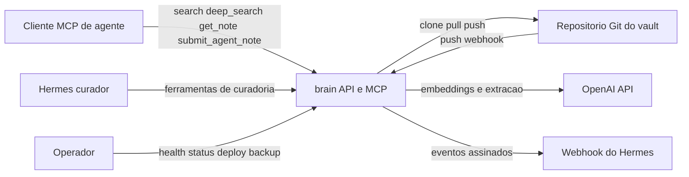
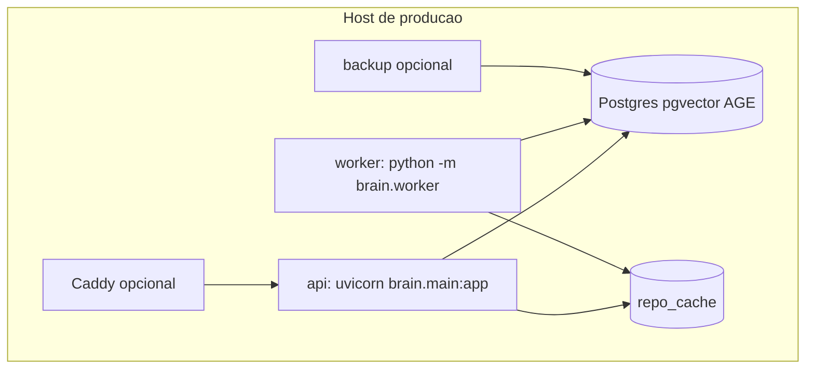
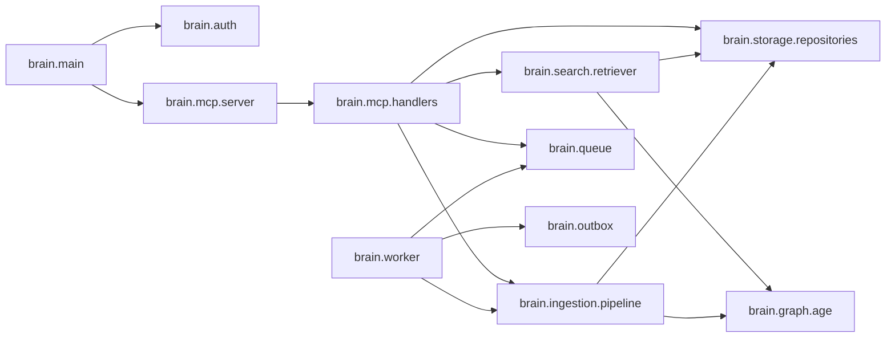
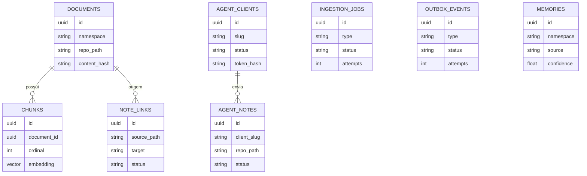

# Technical Documentation Implementation Plan

> **For agentic workers:** REQUIRED SUB-SKILL: Use superpowers:subagent-driven-development (recommended) or superpowers:executing-plans to implement this plan task-by-task. Steps use checkbox (`- [ ]`) syntax for tracking.

**Goal:** Criar a documentação técnica versionada do projeto `brain` em múltiplos arquivos Markdown para mantenedores e integradores MCP.

**Architecture:** A documentação fica em `docs/`, organizada por necessidade de leitura: visão geral, arquitetura, referência MCP, desenvolvimento, operação, modelo de dados, segurança e decisões arquiteturais. O README raiz permanece como guia rápido e recebe apenas um link curto para a documentação técnica.

**Tech Stack:** Markdown, Mermaid, Git, Python 3.12, FastAPI, MCP, SQLAlchemy async, Alembic, Postgres, pgvector, Apache AGE, Docker Compose, uv.

---

## Source Spec

- `docs/superpowers/specs/2026-06-18-technical-documentation-design.md`

Read the spec before starting execution. The documentation must describe the current codebase, not a desired future architecture.

## File Structure

- Create: `docs/README.md`  
  Main entrypoint for technical documentation, reader map, conventions, and links.

- Create: `docs/architecture.md`  
  Architecture explanation with Mermaid diagrams for context, containers, internal components, and core flows.

- Create: `docs/mcp-api.md`  
  MCP integration reference: endpoint, authentication, principals, tools, contracts, permissions, examples, and compatibility rules.

- Create: `docs/development.md`  
  Maintainer guide: local setup, tests, package structure, and safe change patterns.

- Create: `docs/operations.md`  
  Production operations guide: Docker Compose, profiles, env vars, healthchecks, worker, queue, outbox, backup, restore, and troubleshooting.

- Create: `docs/data-model.md`  
  Persistence reference: SQL tables, AGE graph, source-of-truth boundaries, derived indexes, and reconstruction rules.

- Create: `docs/security.md`  
  Security reference: authentication, token storage, permissions, webhooks, path safety, secrets, and inbox risks.

- Create: `docs/decisions/README.md`  
  ADR index and contribution guidance for future architecture decisions.

- Create: `docs/decisions/0001-documentation-architecture.md`  
  First ADR documenting the decision to organize documentation by reader need.

- Modify: `README.md`  
  Add a short link from the root README to `docs/README.md`.

## Task 1: Documentation Index And ADR Foundation

**Files:**
- Create: `docs/README.md`
- Create: `docs/decisions/README.md`
- Create: `docs/decisions/0001-documentation-architecture.md`
- Modify: `README.md`

- [ ] **Step 1: Create `docs/README.md`**

Write `docs/README.md` in Portuguese with this exact section structure:

```markdown
# brain — Documentação Técnica

## Visão Geral

## Para Quem Mantém O Projeto

## Para Quem Integra Via MCP

## Mapa Da Documentação

## Convenções

## Referências De Prática
```

Content requirements:

- State that `brain` is a FastAPI and MCP service for a curated Markdown vault.
- State that clients search and read curated notes, while raw agent submissions enter `_agents/` for Hermes curation.
- Under maintainer guidance, link to `architecture.md`, `development.md`, `operations.md`, `data-model.md`, `security.md`, and `decisions/README.md`.
- Under MCP integrator guidance, link to `mcp-api.md`, `security.md`, and `operations.md`.
- In "Mapa Da Documentação", include a table with columns `Documento`, `Leitor principal`, and `Quando usar`.
- In "Convenções", document Portuguese technical writing, Mermaid diagrams, relative links, and docs updates in the same change that alters architecture, public MCP contracts, deployment, data model, or security behavior.
- In "Referências De Prática", cite Diátaxis, C4 Model, Cognitect ADR article, and Martin Fowler ADR page using full URLs.

- [ ] **Step 2: Create `docs/decisions/README.md`**

Write `docs/decisions/README.md` with this section structure:

```markdown
# Architecture Decision Records

## Objetivo

## Quando Criar Um ADR

## Formato

## Decisões
```

Content requirements:

- Explain that ADRs capture architecturally significant decisions.
- Define architecturally significant as changes that affect structure, non-functional properties, dependencies, interfaces, deployment, security, persistence, or construction techniques.
- Specify the format: `Status`, `Contexto`, `Decisão`, `Consequências`.
- Link to `[0001-documentation-architecture.md](0001-documentation-architecture.md)`.

- [ ] **Step 3: Create the first ADR**

Write `docs/decisions/0001-documentation-architecture.md` with this section structure:

```markdown
# 0001 — Arquitetura Da Documentação Técnica

- **Status:** Aceita
- **Data:** 2026-06-18

## Contexto

## Decisão

## Consequências
```

Content requirements:

- Context: the root README is good for production quickstart, but maintainers and MCP integrators need deeper technical documentation.
- Decision: store Markdown docs in `docs/`, split by reader need, use Mermaid for diagrams, use C4 simplification for architecture, and maintain ADRs in `docs/decisions/`.
- Consequences: easier navigation and smaller reviewable documents; architecture, public MCP contracts, deployment, data model, and security changes require doc updates.

- [ ] **Step 4: Add a short root README link**

Modify `README.md` after the opening description paragraph and add:

```markdown
Documentação técnica detalhada: [docs/README.md](docs/README.md).
```

Do not move existing README sections.

- [ ] **Step 5: Verify navigation files**

Run:

```bash
test -f docs/README.md
test -f docs/decisions/README.md
test -f docs/decisions/0001-documentation-architecture.md
rg -n "\\[architecture\\.md\\]\\(architecture\\.md\\)|\\[mcp-api\\.md\\]\\(mcp-api\\.md\\)|\\[security\\.md\\]\\(security\\.md\\)" docs/README.md
rg -n "\\[docs/README\\.md\\]\\(docs/README\\.md\\)" README.md
git diff --check
```

Expected:

- `test` commands exit with status 0.
- `rg` prints lines containing the expected links.
- `git diff --check` prints no output.

- [ ] **Step 6: Commit Task 1**

Run:

```bash
git add README.md docs/README.md docs/decisions/README.md docs/decisions/0001-documentation-architecture.md
git commit -m "docs(brain): add technical documentation index"
```

Expected: commit succeeds and includes only the four files from this task.

## Task 2: Architecture Documentation

**Files:**
- Create: `docs/architecture.md`

- [ ] **Step 1: Create `docs/architecture.md`**

Write `docs/architecture.md` in Portuguese with this exact section structure:

```markdown
# Arquitetura

## Resumo

## Contexto Do Sistema

## Containers

## Componentes Internos

## Fluxos Principais

## Fronteiras Arquiteturais

## Arquivos De Referência
```

Content requirements:

- Describe `brain` as a FastAPI service that exposes public operational HTTP endpoints and mounts a streamable HTTP MCP server at `/mcp`.
- Name external actors: agent clients, Hermes curator, operators, GitHub/vault repository, OpenAI API, and Hermes webhook receiver.
- Name runtime services: `api`, `worker`, `postgres`, optional `caddy`, optional `backup`, and shared `repo_cache`.
- Explain that Postgres includes pgvector for embeddings and Apache AGE for graph traversal.
- Explain that `repo_cache` is a local clone/cache of the Markdown vault and is shared by API and worker in Docker Compose.

- [ ] **Step 2: Add the context Mermaid diagram**

Include a `flowchart LR` diagram under `## Contexto Do Sistema` with these nodes and relationships:



Add one paragraph below the diagram explaining that the diagram omits internal Postgres tables because they appear in `data-model.md`.

- [ ] **Step 3: Add the container Mermaid diagram**

Include a `flowchart TB` diagram under `## Containers` with these nodes and relationships:



Add bullets describing the responsibility of each container.

- [ ] **Step 4: Add the internal components Mermaid diagram**

Include a `flowchart LR` diagram under `## Componentes Internos` with these modules:



Describe each module in one bullet each.

- [ ] **Step 5: Document the core flows**

Under `## Fluxos Principais`, add subsections:

```markdown
### Webhook GitHub Para Indexação

### Criação Ou Atualização De Nota Curada

### Submissão De Nota Bruta Por Cliente

### Busca Semântica

### Deep Search

### Entrega Do Outbox Para Hermes
```

For each subsection, include a Mermaid `sequenceDiagram` or `flowchart` and a short paragraph.

Minimum details per flow:

- GitHub webhook verifies HMAC, ignores non-push events and brain-bot commits, pulls repo, normalizes changed Markdown paths, and enqueues jobs.
- Curated note creation/update writes Markdown through `git_writer`, indexes through `pipeline.index_document`, extracts links, and prevents `_agents/` writes.
- Raw note submission requires client principal, writes under `_agents/{slug}/`, persists `agent_notes`, creates `agent_note.created` outbox event, and can push to Git.
- Search embeds the query and searches curated document chunks only.
- Deep search returns curated text results plus AGE graph context from seed entities, with namespace rules documented in `mcp-api.md`.
- Outbox delivery signs events for Hermes, retries with backoff, and marks delivered, retrying, or failed.

- [ ] **Step 6: Document boundaries and references**

Under `## Fronteiras Arquiteturais`, include bullets for:

- Curated notes are readable and searchable.
- `_agents/` is raw inbox and is not indexed for public search.
- `memories` are persisted but not returned by public MCP search.
- Administrative graph tools are curator-only.
- `/health` is public, `/status` uses `BRAIN_AUTH_TOKEN`, `/mcp` uses curator or client principals.

Under `## Arquivos De Referência`, link to:

- `../src/brain/main.py`
- `../src/brain/mcp/server.py`
- `../src/brain/mcp/handlers.py`
- `../src/brain/search/retriever.py`
- `../src/brain/ingestion/pipeline.py`
- `../src/brain/worker.py`
- `../docker-compose.yml`

- [ ] **Step 7: Verify architecture documentation**

Run:

```bash
test -f docs/architecture.md
rg -n "flowchart|sequenceDiagram" docs/architecture.md
rg -n "brain\\.main|brain\\.mcp\\.handlers|brain\\.graph\\.age|deep_search|_agents" docs/architecture.md
git diff --check
```

Expected:

- `test` exits with status 0.
- First `rg` prints Mermaid diagram declarations.
- Second `rg` prints lines for all core modules and boundaries.
- `git diff --check` prints no output.

- [ ] **Step 8: Commit Task 2**

Run:

```bash
git add docs/architecture.md
git commit -m "docs(brain): document architecture"
```

Expected: commit succeeds and includes only `docs/architecture.md`.

## Task 3: MCP API Reference

**Files:**
- Create: `docs/mcp-api.md`

- [ ] **Step 1: Create `docs/mcp-api.md`**

Write `docs/mcp-api.md` in Portuguese with this exact section structure:

```markdown
# Referência MCP

## Endpoint E Transporte

## Autenticação E Principals

## Matriz De Ferramentas

## Ferramentas De Cliente

## Ferramentas De Curadoria

## Ferramentas Administrativas

## Contratos Principais

## Compatibilidade E Limites

## Exemplos De Integração

## Arquivos De Referência
```

- [ ] **Step 2: Document endpoint and authentication**

Under `## Endpoint E Transporte`, state:

- Endpoint: `/mcp`.
- Transport: streamable HTTP from `FastMCP`.
- Requests must include `Authorization: Bearer <token>`, but use `brain_client_exemplo_123456` as the example token string.
- `/status` is not MCP auth and uses `BRAIN_AUTH_TOKEN`.

Under `## Autenticação E Principals`, document:

- `curator`: bootstrapped by `BRAIN_CURATOR_TOKEN`.
- `client`: created by curator tools and authenticated by stored token hash.
- Invalid or missing bearer token receives `401`.
- Principal context is set by `brain.auth` middleware before MCP handlers execute.

- [ ] **Step 3: Add a tool permission matrix**

Under `## Matriz De Ferramentas`, add a Markdown table with columns `Ferramenta`, `Cliente`, `Curador`, and `Observação`.

Include these rows:

- `search`
- `deep_search`
- `get_note`
- `submit_agent_note`
- `create_note`
- `update_note`
- `list_vault_tree`
- `list_unresolved_links`
- `resolve_note_link`
- `create_agent_client`
- `list_agent_clients`
- `get_agent_client`
- `reveal_agent_client_token`
- `rotate_agent_client_token`
- `disable_agent_client`
- `list_agent_notes`
- `get_agent_note`
- `claim_agent_note`
- `complete_agent_note`
- `reject_agent_note`
- `fail_agent_note`
- `get_document`
- `list_documents`
- `reindex`
- `get_entity`
- `search_entities`
- `get_related`
- `update_entity`
- `merge_entities`
- `delete_entity`

Use `sim` and `não` in the permission columns.

- [ ] **Step 4: Document client tools**

Under `## Ferramentas De Cliente`, create subsections for:

```markdown
### `search`

### `deep_search`

### `get_note`

### `submit_agent_note`
```

For each subsection, include:

- Purpose.
- Input parameters.
- Output shape.
- Permission notes.
- Boundary notes for curated notes and `_agents/`.

For `search`, document:

```text
search(query: str, limit: int = 10, filters: dict | None = None) -> dict
```

For `deep_search`, document:

```text
deep_search(query: str, limit: int = 10, depth: int = 1, max_entities: int = 3, rel_types: list[str] | None = None, filters: dict | None = None, namespace: str | None = None) -> dict
```

For `get_note`, document:

```text
get_note(id_or_path: str) -> dict | None
```

For `submit_agent_note`, document:

```text
submit_agent_note(title: str | None = None, content: str | None = None, messages: list[dict] | None = None, suggested_namespace: str | None = None, metadata: dict | None = None) -> dict
```

- [ ] **Step 5: Document curator and administrative tools**

Under `## Ferramentas De Curadoria`, group tools into:

- Client lifecycle.
- Raw agent note lifecycle.
- Curated note lifecycle.
- Vault tree and link resolution.

Under `## Ferramentas Administrativas`, group tools into:

- Documents and reindexing.
- Graph entities and relationships.

State that administrative tools are exposed for curator operations and compatibility, not for agent clients.

- [ ] **Step 6: Add contracts and JSON examples**

Under `## Contratos Principais`, include short JSON examples for:

- `search` response with one curated document result.
- `deep_search` response with `results`, `graph.entities`, `graph.relationships`, and `meta`.
- `submit_agent_note` response with id, client slug, repo path, status, metadata, and created timestamp.
- `create_agent_client` response with token returned once.

Use concrete non-secret example values:

- `projetos/brain.md`
- `curated`
- `brain`
- `Hermes`
- `brain_client_exemplo_123456`
- `2026-06-18T12:00:00+00:00`

Do not include real `.env` values.

- [ ] **Step 7: Document compatibility and limits**

Under `## Compatibilidade E Limites`, include bullets:

- `search` remains semantic search over curated document chunks.
- `limit` is normalized by repository search limits.
- `deep_search.depth` accepts integers from 1 to 3.
- `deep_search.max_entities` accepts integers from 1 to 3.
- Empty `rel_types` is normalized to no relationship-type filter.
- Empty or omitted `namespace` means global graph lookup.
- Explicit `namespace` limits only graph lookup; textual search remains curated.
- Clients can use `deep_search` globally or with explicit namespace.

- [ ] **Step 8: Add files of reference and verify**

Under `## Arquivos De Referência`, link to:

- `../src/brain/mcp/server.py`
- `../src/brain/mcp/handlers.py`
- `../src/brain/auth.py`
- `../src/brain/search/retriever.py`

Run:

```bash
test -f docs/mcp-api.md
rg -n "search\\(|deep_search\\(|submit_agent_note\\(|create_agent_client|BRAIN_AUTH_TOKEN" docs/mcp-api.md
rg -n "brain_client_exemplo_123456|projetos/brain\\.md|2026-06-18T12:00:00\\+00:00" docs/mcp-api.md
git diff --check
```

Expected:

- `test` exits with status 0.
- First `rg` prints contract and auth references.
- Second `rg` prints example values.
- `git diff --check` prints no output.

- [ ] **Step 9: Commit Task 3**

Run:

```bash
git add docs/mcp-api.md
git commit -m "docs(brain): document mcp api"
```

Expected: commit succeeds and includes only `docs/mcp-api.md`.

## Task 4: Development Guide

**Files:**
- Create: `docs/development.md`

- [ ] **Step 1: Create `docs/development.md`**

Write `docs/development.md` in Portuguese with this exact section structure:

```markdown
# Desenvolvimento

## Requisitos

## Setup Local

## Testes

## Estrutura Do Código

## Como Adicionar Uma Ferramenta MCP

## Como Adicionar Uma Migration

## Como Adicionar Um Job De Worker

## Como Alterar Busca Ou Grafo

## Convenções De Manutenção

## Arquivos De Referência
```

- [ ] **Step 2: Document requirements and setup**

Under `## Requisitos`, list:

- Python 3.12 or newer.
- `uv`.
- Docker.
- Git.
- Access to an OpenAI-compatible API key for real embedding and extraction calls.

Under `## Setup Local`, include commands:

```bash
docker build -t brain-postgres:local docker/postgres
uv sync
cp .env.example .env
```

Explain that `.env` must use local or development secrets and must not be committed.

- [ ] **Step 3: Document tests**

Under `## Testes`, include commands:

```bash
uv run pytest
uv run pytest tests/test_config.py -q
uv run pytest tests/integration/test_mcp_handlers.py -q
uv run pytest tests/integration/test_graph.py -q
```

Explain:

- Unit tests live in `tests/`.
- Integration tests live in `tests/integration/`.
- Postgres integration tests depend on the local Docker image with pgvector and AGE.
- MCP, queue, worker, repository, and AGE changes need integration coverage.

- [ ] **Step 4: Document package structure**

Under `## Estrutura Do Código`, describe responsibilities for:

- `src/brain/main.py`
- `src/brain/auth.py`
- `src/brain/config.py`
- `src/brain/mcp/server.py`
- `src/brain/mcp/handlers.py`
- `src/brain/storage/models.py`
- `src/brain/storage/repositories.py`
- `src/brain/ingestion/pipeline.py`
- `src/brain/ingestion/git_writer.py`
- `src/brain/search/retriever.py`
- `src/brain/graph/age.py`
- `src/brain/queue/`
- `src/brain/outbox.py`
- `src/brain/worker.py`

- [ ] **Step 5: Document change recipes**

Add practical steps for:

- Adding an MCP tool: define handler, register in server, enforce principal, add integration tests.
- Adding a migration: update models if needed, add Alembic revision, run upgrade tests.
- Adding a worker job: add job type, handler path, queue tests, retry behavior.
- Altering search or graph: keep `search` contract stable, add retriever tests, add AGE integration tests.

Mention exact test files to inspect:

- `tests/integration/test_mcp_handlers.py`
- `tests/integration/test_retriever.py`
- `tests/integration/test_graph.py`
- `tests/integration/test_worker.py`
- `tests/integration/test_migrations.py`

- [ ] **Step 6: Document maintenance conventions**

Under `## Convenções De Manutenção`, include bullets:

- Prefer existing module boundaries.
- Keep public contracts in handlers explicit.
- Keep repository functions focused on persistence.
- Keep `repo_path` validation centralized through `normalize_repo_path`.
- Do not index `_agents/`.
- Do not expose `memories` through public MCP search.
- Use integration tests when touching DB, queue, worker, MCP, or AGE.
- Update docs when changing architecture, public MCP contracts, deployment, data model, or security behavior.

- [ ] **Step 7: Verify development documentation**

Run:

```bash
test -f docs/development.md
rg -n "uv sync|uv run pytest|docker build -t brain-postgres:local docker/postgres" docs/development.md
rg -n "src/brain/mcp/handlers.py|tests/integration/test_mcp_handlers.py|normalize_repo_path|_agents" docs/development.md
git diff --check
```

Expected:

- `test` exits with status 0.
- First `rg` prints setup and test commands.
- Second `rg` prints maintenance references.
- `git diff --check` prints no output.

- [ ] **Step 8: Commit Task 4**

Run:

```bash
git add docs/development.md
git commit -m "docs(brain): add development guide"
```

Expected: commit succeeds and includes only `docs/development.md`.

## Task 5: Operations Guide

**Files:**
- Create: `docs/operations.md`

- [ ] **Step 1: Create `docs/operations.md`**

Write `docs/operations.md` in Portuguese with this exact section structure:

```markdown
# Operação

## Serviços

## Variáveis De Ambiente

## Deploy

## Endpoints Operacionais

## Webhook Do GitHub

## Worker E Fila

## Outbox Para Hermes

## Backup E Restore

## Troubleshooting

## Arquivos De Referência
```

- [ ] **Step 2: Document services and environment variables**

Under `## Serviços`, describe:

- `postgres`
- `api`
- `worker`
- `caddy`
- `backup`

Under `## Variáveis De Ambiente`, create tables by category:

- Infra: `POSTGRES_PASSWORD`, `DATABASE_URL`, `REPO_URL`, `REPO_CACHE_PATH`
- Auth and secrets: `OPENAI_API_KEY`, `GITHUB_TOKEN`, `BRAIN_AUTH_TOKEN`, `BRAIN_CURATOR_TOKEN`, `BRAIN_TOKEN_ENCRYPTION_KEY`, `WEBHOOK_SECRET`
- Curator identity: `BRAIN_CURATOR_SLUG`, `BRAIN_CURATOR_NAME`
- Git: `GIT_PUSH_ENABLED`
- Public domain: `BRAIN_DOMAIN`, `BRAIN_HTTP_PORT`, `BRAIN_HTTPS_PORT`
- Hermes webhook: `HERMES_WEBHOOK_URL`, `HERMES_WEBHOOK_SECRET`
- Backup: `BRAIN_BACKUP_INTERVAL_SECONDS`, `BRAIN_BACKUP_RETENTION_DAYS`

State what each variable controls. Do not include secret values.

- [ ] **Step 3: Document deploy commands**

Under `## Deploy`, include commands:

```bash
cp .env.example .env
docker compose build
docker compose up -d
curl http://localhost:8000/health
docker compose --profile proxy up -d
docker compose --profile backup up -d backup
```

State expected `/health` response:

```json
{"status":"ok","database":"ok"}
```

- [ ] **Step 4: Document endpoints, webhook, worker, and outbox**

Under `## Endpoints Operacionais`, document:

- `GET /health`: public healthcheck.
- `GET /status`: requires `Authorization: Bearer $BRAIN_AUTH_TOKEN`.
- `POST /webhook/github`: requires GitHub HMAC signature.
- `/mcp`: protected by curator or client principal tokens.

Under `## Webhook Do GitHub`, document push-only events, signature verification, brain-bot commit ignore, changed Markdown path normalization, and job enqueueing.

Under `## Worker E Fila`, document job types:

- `index_document`
- `reindex`
- `delete_document`
- `extract_facts`

Document stale job release and retry behavior at a high level.

Under `## Outbox Para Hermes`, document:

- `HERMES_WEBHOOK_URL`
- `HERMES_WEBHOOK_SECRET`
- `X-Brain-Signature`
- `X-Brain-Event-Type`
- `X-Brain-Event-Id`
- `X-Brain-Timestamp`
- `X-Hub-Signature-256` compatibility header

- [ ] **Step 5: Document backup, restore, and troubleshooting**

Under `## Backup E Restore`, document:

- Backup profile creates custom `pg_dump` files in the `backups` volume.
- One-shot backup command:

```bash
docker compose --profile backup run --rm -e BRAIN_BACKUP_ONCE=true backup
```

- Restore requires a compatible Postgres with pgvector and AGE extensions enabled before restoring application data.

Under `## Troubleshooting`, add a table with columns `Sintoma`, `Causa provável`, and `Ação`.

Include rows for:

- `/health` returns 503.
- GitHub webhook returns 401.
- Worker does not process jobs.
- Push to Git fails.
- Embedding or LLM calls fail.
- AGE or pgvector extension is missing.
- Outbox events remain pending.

- [ ] **Step 6: Add files of reference and verify**

Under `## Arquivos De Referência`, link to:

- `../docker-compose.yml`
- `../Dockerfile`
- `../Caddyfile`
- `../docker/backup/backup.sh`
- `../docker/postgres/Dockerfile`
- `../docker/postgres/init/01-extensions.sql`
- `../src/brain/main.py`
- `../src/brain/worker.py`
- `../src/brain/outbox.py`
- `../src/brain/queue/postgres_queue.py`

Run:

```bash
test -f docs/operations.md
rg -n "docker compose up -d|/health|/status|/webhook/github|HERMES_WEBHOOK_URL|BRAIN_BACKUP_INTERVAL_SECONDS" docs/operations.md
rg -n "X-Brain-Signature|X-Hub-Signature-256|index_document|extract_facts" docs/operations.md
git diff --check
```

Expected:

- `test` exits with status 0.
- First `rg` prints deploy and env references.
- Second `rg` prints outbox and worker references.
- `git diff --check` prints no output.

- [ ] **Step 7: Commit Task 5**

Run:

```bash
git add docs/operations.md
git commit -m "docs(brain): add operations guide"
```

Expected: commit succeeds and includes only `docs/operations.md`.

## Task 6: Data Model Reference

**Files:**
- Create: `docs/data-model.md`

- [ ] **Step 1: Create `docs/data-model.md`**

Write `docs/data-model.md` in Portuguese with this exact section structure:

```markdown
# Modelo De Dados

## Visão Geral

## Diagrama ER

## Tabelas

## Grafo AGE

## Fonte De Verdade E Índices Derivados

## Regras De Reconstrução

## Arquivos De Referência
```

- [ ] **Step 2: Add Mermaid ER diagram**

Under `## Diagrama ER`, include an `erDiagram` with:



Add a note that the diagram is intentionally simplified and that SQLAlchemy models are authoritative for field-level details.

- [ ] **Step 3: Document each table**

Under `## Tabelas`, add subsections for:

- `namespaces`
- `documents`
- `chunks`
- `memories`
- `ingestion_jobs`
- `agent_clients`
- `agent_notes`
- `outbox_events`
- `note_links`

For each subsection, include:

- Responsibility.
- Key fields.
- Lifecycle notes.
- Whether it is source-of-truth data, derived index data, or operational state.

Classify:

- `documents`: indexed representation of curated vault notes.
- `chunks`: derived vector index from `documents`.
- `memories`: persisted facts, not public MCP search.
- `ingestion_jobs`: operational queue state.
- `agent_clients`: source of truth for client identity and token metadata.
- `agent_notes`: operational and audit record for raw inbox notes.
- `outbox_events`: operational delivery state.
- `note_links`: derived link index from curated notes.

- [ ] **Step 4: Document AGE graph and reconstruction**

Under `## Grafo AGE`, explain:

- Graph name: `brain`.
- Entity nodes are managed by `brain.graph.age`.
- Entity and relationship extraction comes from LLM extraction during document indexing or fact extraction.
- `deep_search` uses graph traversal through `get_relationship_paths`.
- Namespace behavior matters: explicit namespace limits graph lookup; omitted namespace allows global graph lookup by seed namespace.

Under `## Fonte De Verdade E Índices Derivados`, include a table:

- Vault Markdown repository.
- `documents`.
- `chunks`.
- AGE graph.
- `note_links`.
- `agent_notes`.
- `outbox_events`.
- `ingestion_jobs`.

Under `## Regras De Reconstrução`, state:

- Curated document indexes can be rebuilt from the vault.
- Chunks and embeddings can be rebuilt by reindexing.
- AGE graph derived from documents can be rebuilt by reindexing with extraction enabled.
- `agent_notes`, `outbox_events`, and queue history should not be discarded without explicit operational decision.

- [ ] **Step 5: Add files of reference and verify**

Under `## Arquivos De Referência`, link to:

- `../src/brain/storage/models.py`
- `../src/brain/storage/repositories.py`
- `../src/brain/graph/age.py`
- `../src/brain/ingestion/pipeline.py`
- `../migrations/versions/0001_inicial.py`
- `../migrations/versions/0002_job_run_after.py`
- `../migrations/versions/0003_agent_inbox_curated_notes.py`

Run:

```bash
test -f docs/data-model.md
rg -n "erDiagram|documents|chunks|agent_clients|agent_notes|outbox_events|note_links|Grafo AGE" docs/data-model.md
rg -n "fonte de verdade|índice derivado|operacional|deep_search|get_relationship_paths" docs/data-model.md
git diff --check
```

Expected:

- `test` exits with status 0.
- First `rg` prints schema and table references.
- Second `rg` prints classification and graph references.
- `git diff --check` prints no output.

- [ ] **Step 6: Commit Task 6**

Run:

```bash
git add docs/data-model.md
git commit -m "docs(brain): document data model"
```

Expected: commit succeeds and includes only `docs/data-model.md`.

## Task 7: Security Reference

**Files:**
- Create: `docs/security.md`

- [ ] **Step 1: Create `docs/security.md`**

Write `docs/security.md` in Portuguese with this exact section structure:

```markdown
# Segurança

## Modelo De Confiança

## Autenticação

## Permissões

## Armazenamento De Tokens

## Webhooks E Assinaturas

## Segurança De Paths

## Inbox `_agents/`

## Segredos E Configuração

## Checklist De Mudanças Sensíveis

## Arquivos De Referência
```

- [ ] **Step 2: Document trust model and authentication**

Under `## Modelo De Confiança`, state:

- Operators control deployment and secrets.
- Hermes curator is trusted to review raw inbox notes and create or update curated notes.
- Agent clients are partially trusted writers to their own raw inbox path.
- MCP clients should never receive raw inbox notes from other clients.
- The vault repository must remain private because `_agents/` content can be committed there.

Under `## Autenticação`, document:

- Curator token from `BRAIN_CURATOR_TOKEN`.
- Client tokens created and rotated by curator tools.
- `/status` token from `BRAIN_AUTH_TOKEN`.
- GitHub webhook HMAC via `WEBHOOK_SECRET`.
- Hermes outbox HMAC via `HERMES_WEBHOOK_SECRET`.

- [ ] **Step 3: Document permissions and token storage**

Under `## Permissões`, add a table with columns `Principal`, `Pode fazer`, and `Não pode fazer`.

Rows:

- `curator`
- `client`
- `operador HTTP`
- `GitHub webhook`

Under `## Armazenamento De Tokens`, document:

- Token hash authenticates clients.
- Token prefix identifies tokens without exposing full token.
- Full client token is recoverable only because it is encrypted with Fernet using `BRAIN_TOKEN_ENCRYPTION_KEY`.
- Curator can reveal or rotate client tokens.
- Secret values must not be logged or committed.

- [ ] **Step 4: Document webhooks, paths, and `_agents/`**

Under `## Webhooks E Assinaturas`, document:

- `X-Hub-Signature-256` for GitHub webhook.
- `X-Brain-Signature`, `X-Brain-Event-Type`, `X-Brain-Event-Id`, and `X-Brain-Timestamp` for Hermes outbox.
- Compatibility `X-Hub-Signature-256` header sent to Hermes.

Under `## Segurança De Paths`, document:

- `normalize_repo_path` protects curated note indexing and webhook paths.
- Curated writes must reject `_agents/` paths.
- Symlink and path traversal cases are covered by worker and handler tests.

Under `## Inbox `_agents/``, document:

- `_agents/` is a workflow boundary, not a confidentiality boundary.
- Raw notes are not indexed for public search.
- Clients cannot read raw notes through MCP.
- Raw notes can still exist in the vault repository and must be treated as sensitive.

- [ ] **Step 5: Document secret handling and sensitive change checklist**

Under `## Segredos E Configuração`, document:

- `.env.example` contains example values only.
- The application rejects unsafe example values at startup for critical settings.
- Production must use strong values for database credentials, OpenAI key, GitHub token, curator token, token encryption key, webhook secret, and repository URL.
- Fernet key generation command:

```bash
python -c "from cryptography.fernet import Fernet; print(Fernet.generate_key().decode())"
```

Under `## Checklist De Mudanças Sensíveis`, include bullets:

- Changing principal permissions requires MCP handler tests.
- Changing token storage requires auth and repository tests.
- Changing path handling requires traversal and symlink tests.
- Changing inbox visibility requires MCP and retriever tests.
- Changing webhook signatures requires signature tests.
- Changing deployment secrets requires README, operations, and security docs updates.

- [ ] **Step 6: Add files of reference and verify**

Under `## Arquivos De Referência`, link to:

- `../src/brain/auth.py`
- `../src/brain/config.py`
- `../src/brain/main.py`
- `../src/brain/mcp/handlers.py`
- `../src/brain/repo_paths.py`
- `../tests/test_auth.py`
- `../tests/test_config.py`
- `../tests/test_signature.py`
- `../tests/integration/test_mcp_handlers.py`
- `../tests/integration/test_worker.py`

Run:

```bash
test -f docs/security.md
rg -n "BRAIN_CURATOR_TOKEN|BRAIN_AUTH_TOKEN|BRAIN_TOKEN_ENCRYPTION_KEY|WEBHOOK_SECRET|HERMES_WEBHOOK_SECRET" docs/security.md
rg -n "normalize_repo_path|_agents|X-Brain-Signature|X-Hub-Signature-256|Fernet" docs/security.md
git diff --check
```

Expected:

- `test` exits with status 0.
- First `rg` prints secret setting names.
- Second `rg` prints safety controls.
- `git diff --check` prints no output.

- [ ] **Step 7: Commit Task 7**

Run:

```bash
git add docs/security.md
git commit -m "docs(brain): document security model"
```

Expected: commit succeeds and includes only `docs/security.md`.

## Task 8: Cross-Documentation Quality Sweep

**Files:**
- Modify: `docs/README.md`
- Modify: `docs/architecture.md`
- Modify: `docs/mcp-api.md`
- Modify: `docs/development.md`
- Modify: `docs/operations.md`
- Modify: `docs/data-model.md`
- Modify: `docs/security.md`
- Modify: `docs/decisions/README.md`
- Modify: `docs/decisions/0001-documentation-architecture.md`
- Modify: `README.md`

- [ ] **Step 1: Verify all expected documentation files exist**

Run:

```bash
test -f docs/README.md
test -f docs/architecture.md
test -f docs/mcp-api.md
test -f docs/development.md
test -f docs/operations.md
test -f docs/data-model.md
test -f docs/security.md
test -f docs/decisions/README.md
test -f docs/decisions/0001-documentation-architecture.md
```

Expected: all commands exit with status 0.

- [ ] **Step 2: Check for forbidden pending markers and accidental secrets**

Run:

```bash
rg -n "TB[D]|TO[D]O|FIXM[E]|placeholde[r]|a defini[r]|\\.\\.\\." docs/README.md docs/architecture.md docs/mcp-api.md docs/development.md docs/operations.md docs/data-model.md docs/security.md docs/decisions/README.md docs/decisions/0001-documentation-architecture.md
rg -n "sk-[A-Za-z0-9]|ghp_[A-Za-z0-9]|DATABASE_URL=.*@|BRAIN_CURATOR_TOKEN=.*|BRAIN_AUTH_TOKEN=.*|WEBHOOK_SECRET=.*|HERMES_WEBHOOK_SECRET=.*" docs/README.md docs/architecture.md docs/mcp-api.md docs/development.md docs/operations.md docs/data-model.md docs/security.md docs/decisions/README.md docs/decisions/0001-documentation-architecture.md
```

Expected: both commands exit with status 1 and print no matches.

- [ ] **Step 3: Check required links and cross references**

Run:

```bash
rg -n "\\[.*\\]\\(architecture\\.md\\)|\\[.*\\]\\(mcp-api\\.md\\)|\\[.*\\]\\(development\\.md\\)|\\[.*\\]\\(operations\\.md\\)|\\[.*\\]\\(data-model\\.md\\)|\\[.*\\]\\(security\\.md\\)|\\[.*\\]\\(decisions/README\\.md\\)" docs/README.md
rg -n "\\.\\./src/brain/main\\.py|\\.\\./src/brain/mcp/handlers\\.py|\\.\\./docker-compose\\.yml|\\.\\./src/brain/storage/models\\.py|\\.\\./src/brain/auth\\.py" docs/architecture.md docs/mcp-api.md docs/operations.md docs/data-model.md docs/security.md
```

Expected:

- First `rg` prints every top-level documentation link from `docs/README.md`.
- Second `rg` prints source file references from the technical documents.

- [ ] **Step 4: Check Mermaid coverage**

Run:

```bash
rg -n "```mermaid" docs/architecture.md docs/data-model.md
rg -n "flowchart|sequenceDiagram|erDiagram" docs/architecture.md docs/data-model.md
```

Expected:

- First `rg` prints Mermaid code block openings.
- Second `rg` prints diagram types for architecture and data model docs.

- [ ] **Step 5: Run docs diff check**

Run:

```bash
git diff --check
git status --short
```

Expected:

- `git diff --check` prints no output.
- `git status --short` shows only documentation files modified since the last task commit, or no output if no final edits were needed.

- [ ] **Step 6: Commit final documentation sweep if any file changed**

If `git status --short` prints modified documentation files, run:

```bash
git add README.md docs/README.md docs/architecture.md docs/mcp-api.md docs/development.md docs/operations.md docs/data-model.md docs/security.md docs/decisions/README.md docs/decisions/0001-documentation-architecture.md
git commit -m "docs(brain): polish technical documentation"
```

Expected: commit succeeds and contains only documentation corrections from the sweep.

If `git status --short` prints no output, record in the task notes that no final sweep commit was necessary.
